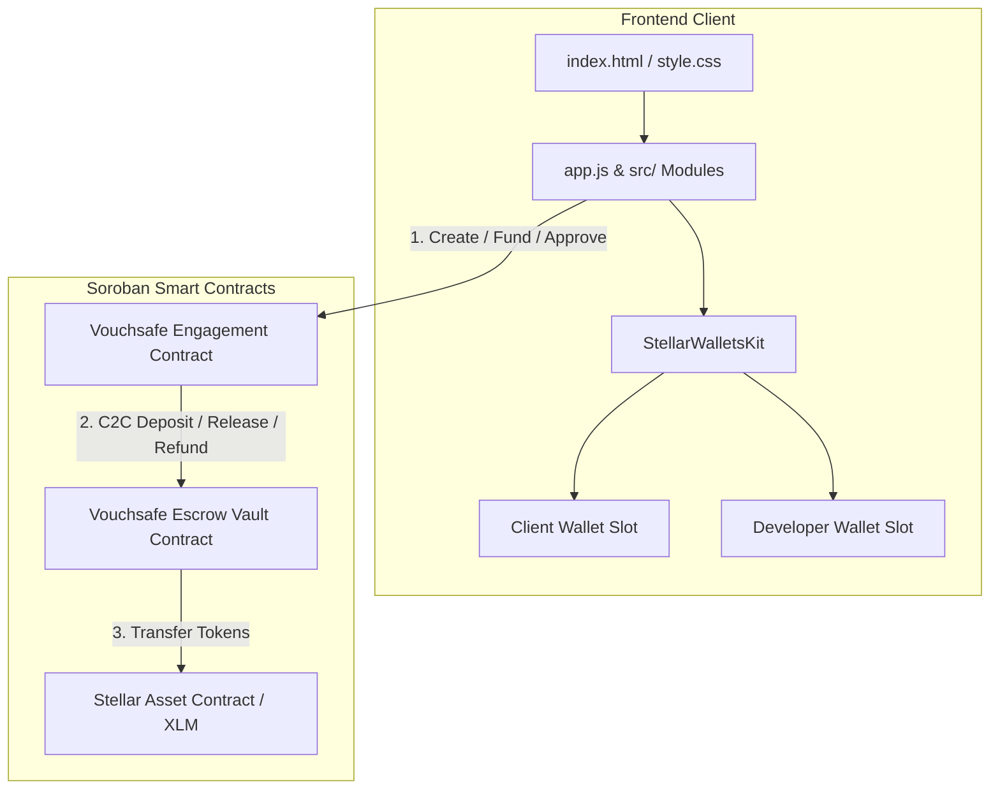

# Vouchsafe — On-Chain Escrow Payment Protocol on Stellar

> A Soroban-powered smart contract escrow protocol on Stellar Testnet that pays technical contributors only after verifiable proof of work is submitted and client-approved.

🌐 **Live Demo**: [https://vouchsafe-eight.vercel.app ↗](https://vouchsafe-eight.vercel.app)

---

## 🏆 Stellar Journey to Mastery — Progression Index

| Belt Level | Milestone Title | Status | Documentation Link |
|------------|-----------------|--------|--------------------|
| ⚪ **White Belt** (Level 1) | Foundation & Core Escrow Contract | ✅ **COMPLETED** | [Read White Belt Specs ↗](docs/README_WHITE_BELT.md) |
| 🟡 **Yellow Belt** (Level 2) | Multi-Wallet Architecture & Live Events | ✅ **COMPLETED** | [Read Yellow Belt Specs ↗](docs/README_YELLOW_BELT.md) |
| 🟠 **Orange Belt** (Level 3) | Advanced Contracts, Inter-Contract Calls & CI/CD | ✅ **COMPLETED** | [Read Orange Belt Specs ↗](docs/README_ORANGE_BELT.md) |

---

## 1. Project Overview

Vouchsafe eliminates trust-based payment risk in technical freelance work and software deliverables. 

Clients deposit funds into a Soroban smart contract escrow. Developers submit verifiable proof of work (GitHub commit hash, PR link, preview URL). Upon inspection, the client approves the deliverable, triggering an **atomic, single-transaction payment release** directly to the developer's wallet.

---

## 2. Problem Being Solved

| Participant | Problem Without Vouchsafe | Vouchsafe Solution |
|-------------|---------------------------|-------------------|
| **Developer** | Delivers work first and invoices after; risks client non-payment or stalling. | Payment is guaranteed and locked in smart contract escrow prior to starting work. |
| **Client** | Pays upfront and risks non-delivery, or uses high-fee legacy escrow intermediaries. | Retains payout control until deliverable proof is submitted and verified. |

---

## 3. Current Project Status

- **Completed Belt Levels**: ⚪ White Belt (Level 1), 🟡 Yellow Belt (Level 2), and 🟠 Orange Belt (Level 3).
- **Contract Deployment**: Live on Stellar Testnet (`CBHLS5OKZWPYZTQA2DH66OJZMD6IZ7U54DVNM3DP5M4R3FSHOOTXMKTR`).
- **Inter-Contract Vault**: Inter-contract cross-invocation architecture separating state machine logic from escrow vault storage.
- **CI/CD Automation**: GitHub Actions pipeline enforcing formatting, compilation, contract unit tests, WASM build, and frontend unit tests.
- **Frontend Integration**: Dual-role multi-wallet dashboard with active signing guards, 5-state transaction lifecycle machine, code-first error classification, deduplicated event polling, and mobile responsiveness.

---

## 4. Technology Stack

- **Smart Contracts**: Rust, Soroban SDK (`soroban-sdk = "21.7.6"`), WASM target (`wasm32-unknown-unknown`).
- **Frontend Core**: Vanilla JavaScript (ES Modules), Modular `src/` Architecture, Custom Responsive CSS3.
- **Stellar Libraries**: `@stellar/stellar-sdk` (v14.0.0), `@creit.tech/stellar-wallets-kit` (v1.7.5).
- **Testing & CI/CD**: Cargo Test Suite, Node.js Native Test Runner (`npm test`), GitHub Actions (`.github/workflows/ci.yml`).

---

## 5. Architecture Overview



---

## 6. Current Stellar Network Configuration

| Property | Setting |
|----------|---------|
| **Network** | Stellar Testnet |
| **Passphrase** | `Test SDF Network ; September 2015` |
| **Soroban RPC** | `https://soroban-testnet.stellar.org` |
| **Stellar Horizon** | `https://horizon-testnet.stellar.org` |
| **Friendbot Faucet** | `https://friendbot.stellar.org/?addr=<ADDRESS>` |

---

## 7. Current Deployed Contract Information

- **Contract ID**: `CBHLS5OKZWPYZTQA2DH66OJZMD6IZ7U54DVNM3DP5M4R3FSHOOTXMKTR`
- **Deployer Address**: `GBCQI56TO2T27F3I4XRZK72NSUFRJAM4M7ZIBCNA35O4W5F7WIJU4VKO`
- **Native XLM SAC Address**: `CDLZFC3SYJYDZT7K67VZ75HPJVIEUVNIXF47ZG2FB2RMQQVU2HHGCYSC`
- **StellarExpert Explorer**: [View Contract Details ↗](https://stellar.expert/explorer/testnet/contract/CBHLS5OKZWPYZTQA2DH66OJZMD6IZ7U54DVNM3DP5M4R3FSHOOTXMKTR)

---

## 8. Quick Start Instructions

### Prerequisites
- Node.js (for local HTTP server & test runner)
- Rust & Cargo (for smart contract build & tests)

### Run Frontend & Tests
```bash
cd "New project/Vouchsafe"

# Run frontend unit test suite
npm test

# Serve application locally
npx serve .
```
Open `http://localhost:8000` in your web browser.

### Run Contract Tests & Build
```bash
# Run Rust workspace contract tests
cargo test --workspace

# Build WASM binaries
cargo build --target wasm32-unknown-unknown --release
```

---

For detailed specifications, architectural diagrams, and verification evidence for completed levels, refer to:
- [⚪ White Belt Documentation (Level 1)](docs/README_WHITE_BELT.md)
- [🟡 Yellow Belt Documentation (Level 2)](docs/README_YELLOW_BELT.md)
- [🟠 Orange Belt Documentation (Level 3)](docs/README_ORANGE_BELT.md)
