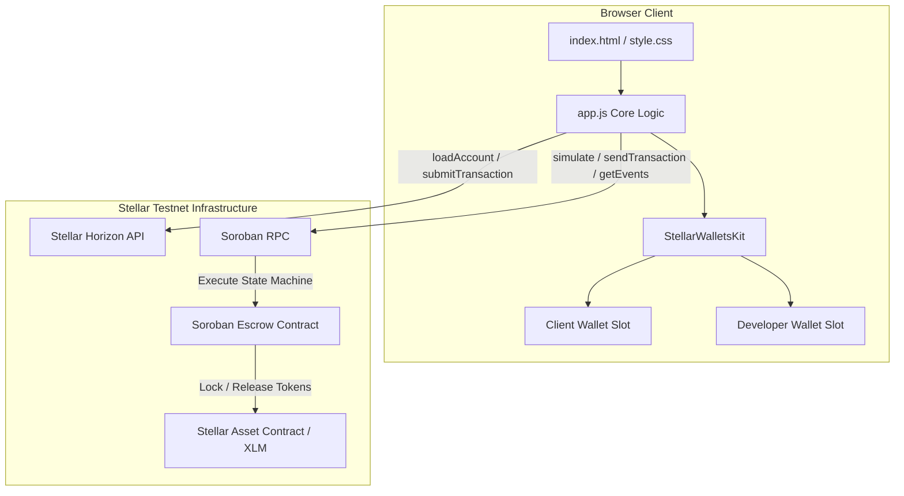

# Vouchsafe — On-Chain Escrow Payment Protocol on Stellar

> A Soroban-powered smart contract escrow protocol on Stellar Testnet that pays technical contributors only after verifiable proof of work is submitted and client-approved.

🌐 **Live Demo**: [https://vouchsafe-eight.vercel.app ↗](https://vouchsafe-eight.vercel.app)

---

## 🏆 Stellar Journey to Mastery — Progression Index

| Belt Level | Milestone Title | Status | Documentation Link |
|------------|-----------------|--------|--------------------|
| ⚪ **White Belt** (Level 1) | Foundation & Core Escrow Contract | ✅ **COMPLETED** | [Read White Belt Specs ↗](docs/README_WHITE_BELT.md) |
| 🟡 **Yellow Belt** (Level 2) | Multi-Wallet Architecture & Live Events | ✅ **COMPLETED** | [Read Yellow Belt Specs ↗](docs/README_YELLOW_BELT.md) |

---

## 1. Project Overview

Vouchsafe eliminates trust-based payment risk in technical freelance work and software deliverables. 

Clients deposit funds into a Soroban smart contract escrow. Developers submit verifiable proof of work (GitHub commit hash, PR link, preview URL). Upon inspection, the client approves the deliverable, triggering an **atomic, single-transaction payment release** directly to the developer's wallet.

---

## 2. Problem Being Solved

| Participant | Problem Without Vouchsafe | Vouchsafe Solution |
|-------------|---------------------------|-------------------|
| **Developer** | Delivers work first and invoices after; risks client non-payment or stalling. | Payment is guaranteed and locked in smart contract escrow prior to starting work. |
| **Client** | Pays upfront and risks non-delivery, or uses high-fee legacy escrow intermediaries. | Retains payout control until deliverable proof is submitted and verified. |

---

## 3. Current Project Status

- **Completed Belt Levels**: ⚪ White Belt (Level 1) & 🟡 Yellow Belt (Level 2).
- **Contract Deployment**: Live on Stellar Testnet (`CBHLS5OKZWPYZTQA2DH66OJZMD6IZ7U54DVNM3DP5M4R3FSHOOTXMKTR`).
- **Frontend Integration**: Dual-role multi-wallet dashboard with active signing guards, 5-state transaction lifecycle machine, code-first error classification, and deduplicated event polling.
- **Verification**: 7 passing contract unit tests + 100% verified E2E Testnet transaction sequence.

---

## 4. Technology Stack

- **Smart Contract**: Rust, Soroban SDK (`soroban-sdk = "22.0.1"`), WASM target (`wasm32-unknown-unknown`).
- **Frontend Core**: Vanilla JavaScript (ES Modules), HTML5, Custom CSS3 (Stripe/Linear technical dashboard aesthetic).
- **Stellar Libraries**: `@stellar/stellar-sdk` (v14.0.0), `@creit.tech/stellar-wallets-kit` (v1.7.5).
- **Blockchain Infrastructure**: Soroban RPC (`https://soroban-testnet.stellar.org`), Stellar Horizon (`https://horizon-testnet.stellar.org`).

---

## 5. Architecture Overview



---

## 6. Current Stellar Network Configuration

| Property | Setting |
|----------|---------|
| **Network** | Stellar Testnet |
| **Passphrase** | `Test SDF Network ; September 2015` |
| **Soroban RPC** | `https://soroban-testnet.stellar.org` |
| **Stellar Horizon** | `https://horizon-testnet.stellar.org` |
| **Friendbot Faucet** | `https://friendbot.stellar.org/?addr=<ADDRESS>` |

---

## 7. Current Deployed Contract Information

- **Contract ID**: `CBHLS5OKZWPYZTQA2DH66OJZMD6IZ7U54DVNM3DP5M4R3FSHOOTXMKTR`
- **Deployer Address**: `GBCQI56TO2T27F3I4XRZK72NSUFRJAM4M7ZIBCNA35O4W5F7WIJU4VKO`
- **Native XLM SAC Address**: `CDLZFC3SYJYDZT7K67VZ75HPJVIEUVNIXF47ZG2FB2RMQQVU2HHGCYSC`
- **StellarExpert Explorer**: [View Contract Details ↗](https://stellar.expert/explorer/testnet/contract/CBHLS5OKZWPYZTQA2DH66OJZMD6IZ7U54DVNM3DP5M4R3FSHOOTXMKTR)

### Verified Live On-Chain Transactions (Yellow Belt Evidence)
- **Create Engagement**: [`c088da058f67426bb675f0167df48dc34199f070aff3b24e18073f88a19c3ef3`](https://stellar.expert/explorer/testnet/tx/c088da058f67426bb675f0167df48dc34199f070aff3b24e18073f88a19c3ef3)
- **Fund Escrow**: [`abfdbb455790385de32675fe8ecb7fa99f10d52fbfbc8f3f64ab58d82580541e`](https://stellar.expert/explorer/testnet/tx/abfdbb455790385de32675fe8ecb7fa99f10d52fbfbc8f3f64ab58d82580541e)
- **Submit Work Proof**: [`4d3acf2d031b80862a5b2f04d786a005cd0cb79b8b6102ff7c899ca1fe7cb14c`](https://stellar.expert/explorer/testnet/tx/4d3acf2d031b80862a5b2f04d786a005cd0cb79b8b6102ff7c899ca1fe7cb14c)
- **Approve & Release Payment**: [`024c19ec4da8dba99d1b247e2e1c61a8cd1b0fab5bfaaf28f2b12ababc76bf93`](https://stellar.expert/explorer/testnet/tx/024c19ec4da8dba99d1b247e2e1c61a8cd1b0fab5bfaaf28f2b12ababc76bf93)

---

## 8. Quick Start Instructions

### Prerequisites
- Node.js (for local HTTP server)
- Rust & Cargo (if building smart contract WASM)

### Run Application Locally
```bash
cd "New project/Vouchsafe"

# Serve using Node.js
npx serve .

# OR serve using Python
python -m http.server 8000
```
Open `http://localhost:8000` in your web browser.

### Run Contract Tests
```bash
cargo test
```
*Note: Contract unit tests compile and run natively. (On Windows `x86_64-pc-windows-gnu` environments, WASM compilation is executed via `cargo build --target wasm32-unknown-unknown --release`).*

---

For detailed specifications, architectural diagrams, and verification evidence for completed levels, refer to:
- [⚪ White Belt Documentation (Level 1)](docs/README_WHITE_BELT.md)
- [🟡 Yellow Belt Documentation (Level 2)](docs/README_YELLOW_BELT.md)

