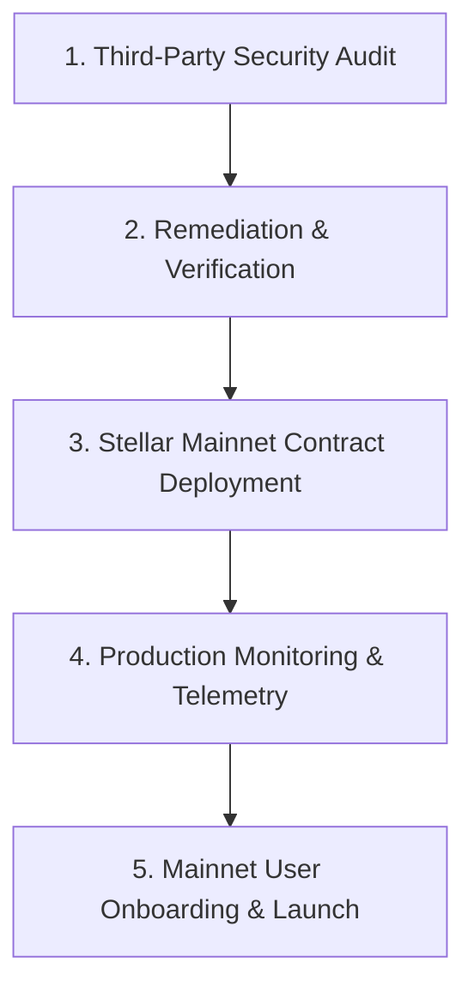

# Vouchsafe — Black Belt Documentation (Level 6)

> **Belt Level**: ⚫ Black Belt  
> **Status**: 📅 PLANNED / FUTURE MILESTONE  
> **Target Network**: Stellar Mainnet  

---

## 1. Level Objective

The objective of Level 6 (Black Belt) is to transition Vouchsafe from Testnet to a fully audited, production-ready Stellar Mainnet protocol:
1. Conduct formal third-party smart contract security audit and remediation.
2. Deploy Vouchsafe Soroban contract to Stellar Mainnet.
3. Establish production infrastructure monitoring, RPC fallback nodes, and incident response procedures.
4. Onboard real-world Mainnet users and achieve verifiable economic volume.

---

## 2. Planned Mainnet Deployment Roadmap

---

## 3. Security Audit & Hardening Plan

### Planned Audit Criteria
- **Smart Contract Verification**: Formal verification of state transition boundaries in `lib.rs`.
- **Reentrancy & Authorization**: Ensuring Soroban sub-invocation auth entries cannot be forged.
- **Arithmetic Safety**: Verification of integer overflow/underflow protections (`checked_add`, `checked_sub`).
- **Resource Footprint**: Verification that ledger read/write fees remain within economical bounds.

> **Status Note**: No formal audit has been conducted yet. Audit will be scheduled prior to Mainnet release.

---

## 4. Production Infrastructure & Monitoring

- **RPC Redundancy**: Multi-region Soroban RPC endpoint routing (QuickNode / Blockdaemon / SDF).
- **On-Chain Indexer**: Dedicated indexer service mapping Soroban events to database storage for sub-second UI rendering.
- **Emergency Circuit Breaker**: Contract pause mechanism (governed by multi-sig admin) for critical bug mitigation.

---

## 5. Demo Day & Ecosystem Presentation

- **Live Mainnet Demo**: Execution of real-value escrow payment on Stellar Mainnet.
- **Ecosystem Metric Dashboard**: Real-time tracking of total locked value (TVL) and completed contract volume.

---

## 6. Next Milestone Progression

Black Belt completion advances the project to **Master Belt (Level 7)** for startup track scale, venture backing, and long-term ecosystem stewardship.
