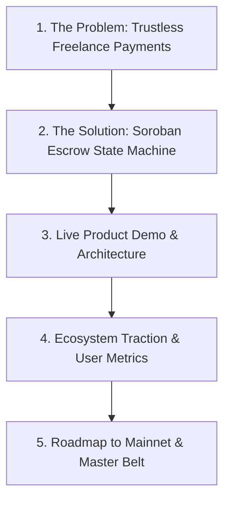

# Vouchsafe — Blue Belt Documentation (Level 5)

> **Belt Level**: 🔵 Blue Belt  
> **Status**: 📅 PLANNED / FUTURE MILESTONE  
> **Target Network**: Stellar Testnet → Mainnet Preparation  

---

## 1. Level Objective

The objective of Level 5 (Blue Belt) is to scale Vouchsafe's user base and prepare the platform for public demonstration and ecosystem integration:
1. Scale active user adoption to 50+ Testnet users across multiple developer communities.
2. Iterative feature improvements driven by quantitative usage analytics and user feedback.
3. Preparation of pitch deck, video demonstration, and hackathon presentation assets.
4. Strategic alignment with Stellar ecosystem grant and incubator tracks.

---

## 2. Milestone Metrics: Planned vs. Actual

| Metric | Target Goal | Current Actual | Status |
|--------|-------------|----------------|--------|
| Active Testnet Users | 50 Users | Cohort Testing Planned | 📅 Planned |
| Total Escrow Volume (Testnet) | 10,000+ XLM | E2E Test Volume Only | 📅 Planned |
| Completed Engagements | 30+ Completed | 2 Verified (E2E Test) | 📅 Planned |
| Pitch Deck & Video Demo | Complete Pitch & Video | Initial Marketing Page Live | 🟡 In Progress |
| Ecosystem Feedback Score | 85%+ CSAT | Pending Cohort | 📅 Planned |

---

## 3. Product Growth & Iteration Plan

Based on initial UX considerations, Blue Belt will focus on:
- **Mobile Wallet Optimization**: Enhanced mobile view responsive styling for LOBSTR and Web3 mobile browsers.
- **Notification Webhooks**: Email / Discord notifications when milestone status changes (e.g. "Work Submitted", "Payment Released").
- **Exportable Invoices**: On-chain cryptographic proof PDF export for client/developer tax and accounting compliance.

---

## 4. Pitch & Demonstration Preparation

### Planned Demo Assets
- **Product Video**: 3-minute walk-through demonstrating dual-wallet client-developer workflow on Testnet.
- **Interactive Sandbox**: One-click demo accounts pre-funded with Testnet XLM for pitch evaluators.

---

## 5. Next Milestone Progression

Achieving 50+ users and completing pitch readiness opens the path to **Black Belt (Level 6)** for Mainnet deployment, formal security audit, and real-world adoption.
