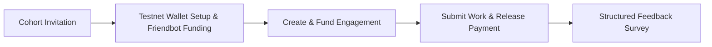

# Vouchsafe — Green Belt Documentation (Level 4)

> **Belt Level**: 🟢 Green Belt  
> **Status**: 📅 PLANNED / FUTURE MILESTONE  
> **Target Network**: Stellar Testnet  

---

## 1. Level Objective

The objective of Level 4 (Green Belt) is to deliver a Production MVP on Stellar Testnet and execute an initial user onboarding cohort with at least 10 active Testnet users. This level focuses on:
1. Hardening frontend stability and UI ergonomics for non-technical users.
2. Onboarding 10 active Testnet users (clients and developers) to complete real escrow cycles.
3. Conducting technical mentor reviews and gathering product-market fit feedback.
4. Implementing security fixes and user experience refinements based on real user feedback.

---

## 2. Milestone Requirements & Planned Status

| Requirement | Target Goal | Current Status | Notes |
|-------------|-------------|----------------|-------|
| Production MVP UI | Polished, responsive web dashboard | 🟡 In Progress | Core dashboard UI exists; pending UX polish. |
| Testnet Deployment | Stable contract deployed on Testnet | ✅ Complete | `CBHLS5OKZWPYZTQA2DH66OJZMD6IZ7U54DVNM3DP5M4R3FSHOOTXMKTR` |
| Testnet User Onboarding | Minimum 10 active Testnet users | 📅 Planned | Cohort testing planned after Orange Belt. |
| Technical Mentor Review | Formal code & architecture review | 📅 Planned | Pending submission for mentor review. |
| User Feedback Synthesis | Structured feedback collection & issue tracking | 📅 Planned | Feedback forms and GitHub issues pipeline. |
| Security Hardening | Static analysis & vulnerability scanning | 📅 Planned | `cargo-audit` and Slither/Soroban security checks. |

---

## 3. Planned User Onboarding Strategy

1. **Target Group**: Early Stellar ecosystem developers, hackathon participants, and freelance contractors.
2. **Onboarding Guide**: Walkthrough documentation detailing Freighter/Albedo setup and Testnet XLM acquisition via Friendbot.
3. **Feedback Metric**: System Usability Scale (SUS) survey focusing on wallet connection smoothness and transaction confirmation clarity.

---

## 4. Technical Mentor Review & Architecture Polish

Planned focus areas for mentor evaluation:
- **Contract Storage Footprint**: Optimization of persistent vs. temporary storage keys in Soroban.
- **TTL Extension**: Automated contract instance and instance data TTL extensions via `env.storage().instance().extend_ttl()`.
- **Frontend RPC Resilience**: Fallback RPC nodes and network retry strategies.

---

## 5. Security & Stability Roadmap

- **Static Code Analysis**: Automated CI pipeline running `cargo clippy` and `cargo-audit`.
- **Input Sanitization**: Client-side and contract-side validation of string URLs, commit hashes, and token addresses.
- **Error Telemetry**: Anonymous client-side error reporting to log unhandled wallet RPC edge cases.

---

## 6. Next Milestone Progression

Upon achieving 10 active Testnet users and incorporating mentor feedback, the project will advance to **Blue Belt (Level 5)** for scaling user adoption, pitch preparation, and ecosystem demo readiness.
