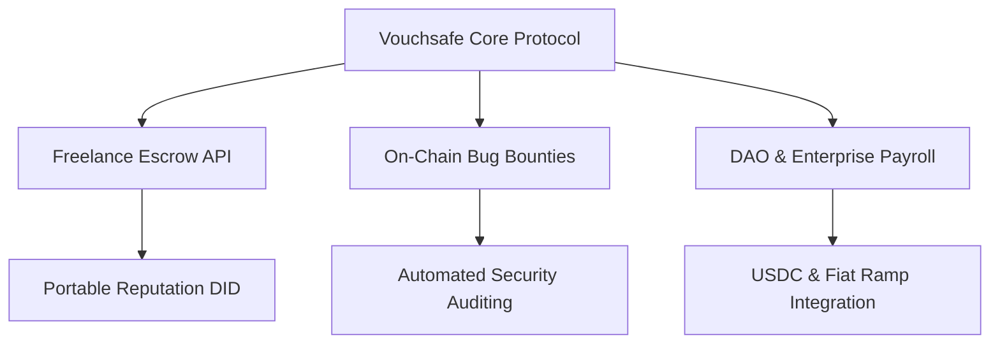

# Vouchsafe — Master Belt Documentation (Level 7)

> **Belt Level**: 🏆 Master Belt  
> **Status**: 📅 PLANNED / FUTURE MILESTONE  
> **Target Network**: Stellar Mainnet & Multi-Chain Ecosystems  

---

## 1. Level Objective

The objective of Level 7 (Master Belt) is to build Vouchsafe into a sustainable, venture-backed Web3 infrastructure company and foundational primitive within the Stellar ecosystem:
1. Transition Vouchsafe into a full startup track with dedicated engineering and business operations.
2. Expand smart contract capabilities to cross-border freelancer payments, automated tax withholding, and decentralized identity (DID) reputation.
3. Integrate with major Web3 freelance marketplaces, DAO tooling, and enterprise payroll platforms.
4. Establish long-term liquidity and ecosystem partnerships within the Stellar network.

---

## 2. Long-Term Strategic Roadmap

---

## 3. Product Vision & Ecosystem Impact

- **Trustless Technical Infrastructure**: Vouchsafe becomes the default escrow standard for developer hires on Stellar.
- **Anchor & Off-Ramp Integration**: Native integration with Stellar Anchors (e.g. MoneyGram Access) to enable seamless local currency cash-outs for developers globally.
- **SDK for Developers**: `@vouchsafe/sdk` NPM package allowing any freelance platform or dApp to embed milestone escrow contracts in under 10 lines of code.

---

## 4. Milestone Governance & Compliance

> **Transparency Note**: Master Belt represents the long-term vision. No venture funding, ecosystem grants, or enterprise partnerships are claimed as completed until formal agreements are executed and publicly documented.
