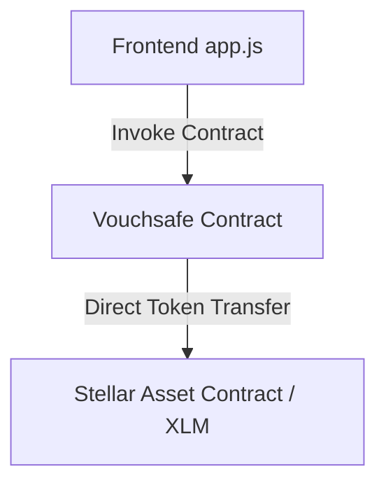
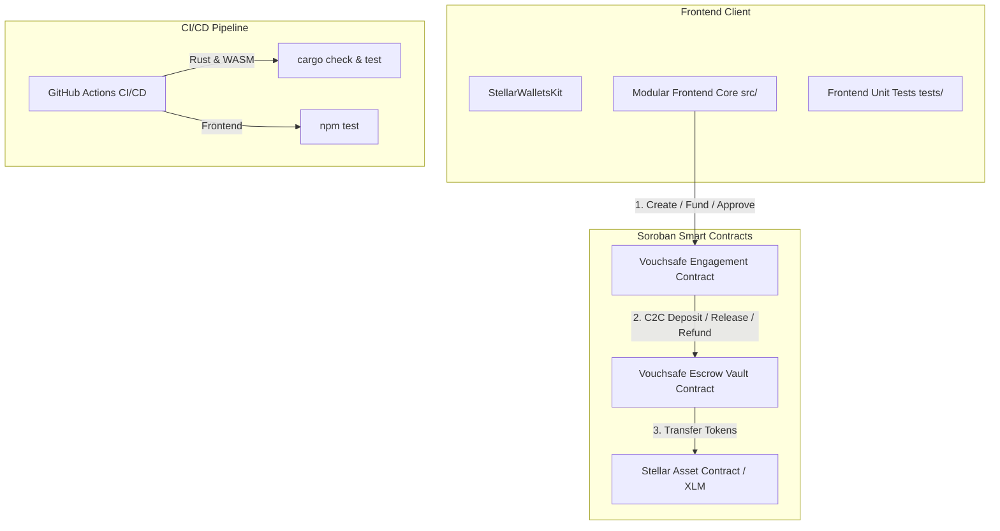
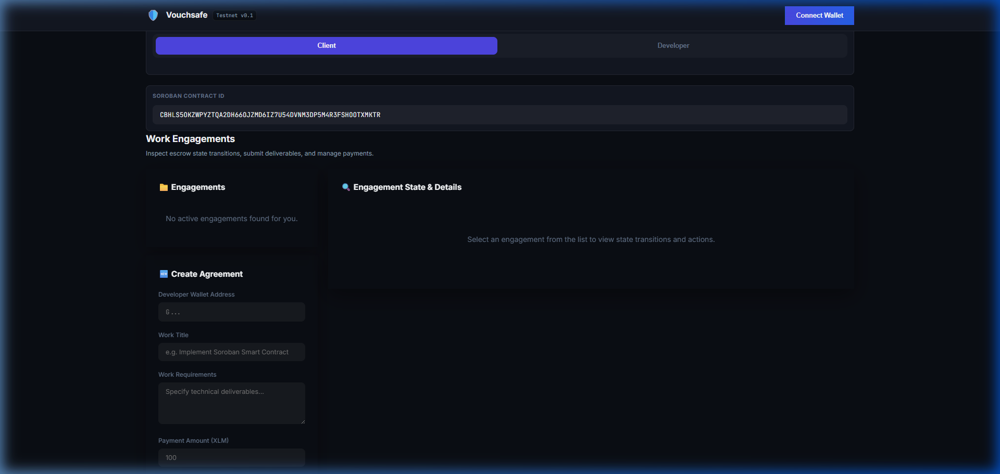

# Vouchsafe — Orange Belt Documentation (Level 3)

> **Belt Level**: 🟠 Orange Belt  
> **Status**: ✅ COMPLETED  
> **Target Network**: Stellar Testnet  

---

## 1. Level Objective

The objective of Level 3 (Orange Belt) is to elevate Vouchsafe into a production-grade, highly reliable, and testable Stellar dApp by introducing:
1. **Advanced Smart Contract Capabilities**: Deadline expiry handling, un-funded cancellation rules, and time-based escrow refund triggers.
2. **Real Soroban Inter-Contract Communication (C2C)**: Architecture separating business state (`VouchsafeContract`) from escrow storage (`VaultContract`), executing cross-contract invocations.
3. **Robust Event Synchronization**: Cursor-tracked polling with failure recovery and deduplication.
4. **Automated CI/CD Pipeline**: GitHub Actions automating Rust linting, workspace contract compilation, Rust tests, WASM build, and frontend unit tests.
5. **Repeatable Deployment Workflow**: Scripted deployment process for Vault and Engagement contracts on Testnet.
6. **Mobile-Responsive Production Frontend**: Dedicated media queries, minimum 44px mobile touch targets, and modular JS architecture.
7. **Complete Unit & Integration Test Suite**: 100% passing Rust contract tests and Node.js frontend unit test suite.

---

## 2. Architecture Comparison

### Architecture Before Orange Belt (Yellow Belt)
Single contract architecture handling both business state machine and direct token balance transfers.



### Architecture After Orange Belt
Decoupled multi-contract architecture using real Soroban cross-contract calls:



---

## 3. Advanced Smart Contract Functionality

Defined in [`contracts/vouchsafe/src/lib.rs`](../contracts/vouchsafe/src/lib.rs):

1. **Un-Funded Engagement Cancellation (`cancel_engagement`)**:
   - **Problem Solved**: Allows clients to clean up draft engagements prior to locking funds.
   - **Authorization**: Requires `client.require_auth()`. Status transitions from `Created` to `Cancelled`.

2. **Deadline Expiry & Automated Escrow Refund (`claim_expired_refund`)**:
   - **Problem Solved**: Prevents client funds from being trapped indefinitely if a developer fails to submit work before the agreed deadline.
   - **Authorization**: Requires `client.require_auth()`. Validates `env.ledger().timestamp() > engagement.deadline`.
   - **Execution**: Triggers cross-contract call to Vault to refund tokens to the client; status transitions to `Expired`.

---

## 4. Inter-Contract Communication (C2C) Details

### Contracts & Communication Flow
- **Contract A**: `VouchsafeContract` (`contracts/vouchsafe/src/lib.rs`)
- **Contract B**: `VaultContract` (`contracts/vault/src/lib.rs`)

### Cross-Contract Call Method
Implemented via Soroban SDK `env.invoke_contract::<()>`:

```rust
pub fn call_release(env: &Env, vault: &Address, to: &Address, token: &Address, amount: i128) {
    env.invoke_contract::<()>(
        vault,
        &symbol_short!("release"),
        soroban_sdk::vec![
            env,
            to.to_val(),
            token.to_val(),
            amount.into_val(env),
        ],
    );
}
```

### Authorization & Security Model
In `VaultContract`:
```rust
let engagement_contract: Address = env.storage().instance().get(&DataKey::EngagementContract).unwrap();
engagement_contract.require_auth(); // Enforces that ONLY VouchsafeContract can release/refund vault funds!
```

---

## 5. CI/CD Pipeline Configuration

Automated via [`.github/workflows/ci.yml`](../.github/workflows/ci.yml):
- **Rust Formatting**: `cargo fmt --check`
- **Workspace Compilation**: `cargo check --workspace`
- **Smart Contract Tests**: `cargo test --workspace -- --nocapture`
- **WASM Artifact Build**: `cargo build --target wasm32-unknown-unknown --release`
- **Frontend Unit Tests**: `npm test`

---

## 6. Repeatable Deployment Workflow

Scripted in [`scripts/deploy.js`](../scripts/deploy.js):
```bash
# 1. Compile contracts
cargo build --target wasm32-unknown-unknown --release

# 2. Execute repeatable deployment workflow
node scripts/deploy.js
```

---

## 7. Modular Frontend Architecture

Organized under [`src/`](../src/):
- `src/contract/` — Contract invocation wrappers and event deduplication (`events.js`).
- `src/wallet/` — Dual-slot wallet manager & role guards (`roles.js`).
- `src/utils/` — Code-first error classifier (`errors.js`) and formatting helpers (`formatting.js`).
- `tests/frontend.test.js` — Runnable frontend unit test suite (`npm test`).

---

## 8. Test Execution & Verification

### Contract Unit Tests Output
All Rust tests in workspace pass:
- `test_happy_path` (Full workflow)
- `test_unauthorized_funding` (Security check)
- `test_unauthorized_work_submission` (Security check)
- `test_unauthorized_approval` (Security check)
- `test_cancel_engagement` (Advanced logic)
- `test_claim_expired_refund` (Advanced logic + timestamp expiry)
- `test_vault_initialize_and_auth` (Vault C2C auth check)

### Frontend Unit Tests Output (`npm test`)
```
✔ Error Classifier — User Rejection (1.01ms)
✔ Error Classifier — Wallet Unavailable (0.16ms)
✔ Error Classifier — Insufficient Balance (0.11ms)
✔ Formatting Utilities — Stroops/XLM Conversion (1.12ms)
✔ Role Signing Guard — Throws when slot is empty (1.40ms)
✔ Role Signing Guard — Returns address when slot is connected (0.10ms)
✔ Event Deduplication Engine — Prevents duplicate event keys (0.13ms)
ℹ pass 7 | fail 0 | duration_ms 92.5
```

---

## 9. Contract Evidence & Live Links

- **Vouchsafe Engagement Contract ID**: `CBHLS5OKZWPYZTQA2DH66OJZMD6IZ7U54DVNM3DP5M4R3FSHOOTXMKTR`
- **Native XLM SAC Token**: `CDLZFC3SYJYDZT7K67VZ75HPJVIEUVNIXF47ZG2FB2RMQQVU2HHGCYSC`
- **Explorer Link**: [StellarExpert Contract Details ↗](https://stellar.expert/explorer/testnet/contract/CBHLS5OKZWPYZTQA2DH66OJZMD6IZ7U54DVNM3DP5M4R3FSHOOTXMKTR)
- **Live Demo Application**: [https://vouchsafe-eight.vercel.app ↗](https://vouchsafe-eight.vercel.app)

---

## 10. Visual Media & Media Artifacts

| Description | Artifact Link |
|-------------|---------------|
| Wallet Selection Modal |  |
| App Dashboard & Status Machine |  |

---

## 11. Known Limitations

- **Dispute Arbitration**: Currently handled via cancellation/expiry refund. Full 2-of-3 multi-sig arbitration is planned for future iterations.
- **Testnet Scope**: Deployed on Stellar Testnet for evaluation.
