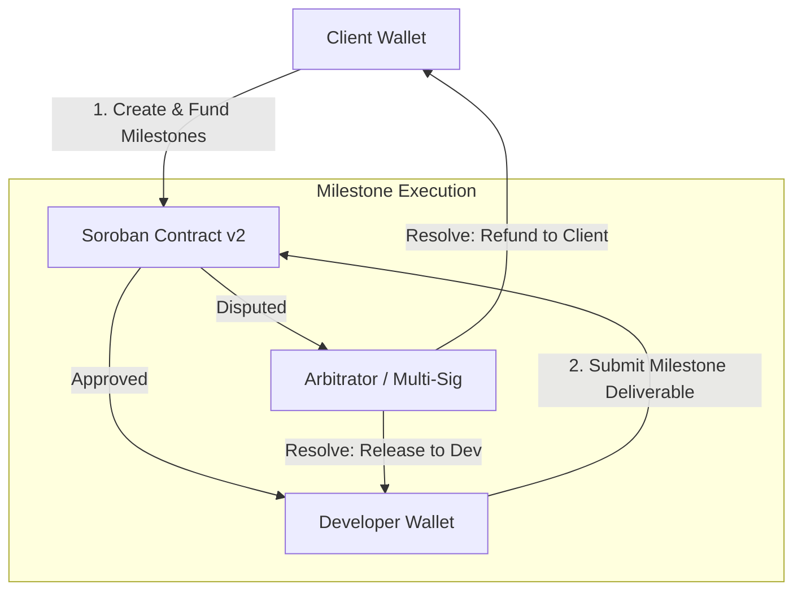

# Vouchsafe — Orange Belt Documentation (Level 3)

> **Belt Level**: 🟠 Orange Belt  
> **Status**: 🚧 IN PROGRESS / PLANNED  
> **Target Network**: Stellar Testnet  

---

## 1. Level Objective

The objective of Level 3 (Orange Belt) is to expand Vouchsafe from a single-milestone escrow state machine into a comprehensive mini-dApp supporting:
1. Multi-milestone engagements with incremental funding and release.
2. Decentralized 2-of-3 multi-signature dispute resolution and arbitration.
3. Enhanced test coverage including contract upgrade mechanisms and time-based lock refund triggers.
4. Production-grade frontend UX enhancements for milestone tracking and dispute submission.

---

## 2. Status & Gap Analysis

```
[White Belt (Level 1): COMPLETE] ──► [Yellow Belt (Level 2): COMPLETE] ──► [Orange Belt (Level 3): IN PROGRESS]
```

### What Has Been Completed (Foundational Base)
- ✅ Core linear escrow smart contract (`CREATED` → `FUNDED` → `WORK_SUBMITTED` → `APPROVED` → `COMPLETED`).
- ✅ 7 passing unit tests covering authorization, double-payment prevention, and state transitions.
- ✅ Multi-wallet integration via `@creit.tech/stellar-wallets-kit` supporting Freighter, Albedo, xBull.
- ✅ Dual wallet slots (Client & Developer) with signing guards (`requireSigningWallet(role)`).
- ✅ 5-state transaction lifecycle banner and classified error handling system.
- ✅ Live event polling with deduplication and sync indicator.
- ✅ Testnet deployment (`CBHLS5OKZWPYZTQA2DH66OJZMD6IZ7U54DVNM3DP5M4R3FSHOOTXMKTR`).

### What Remains To Be Implemented (Orange Belt Scope)
- ⏳ **Multi-Milestone Contract Logic**: Structuring engagements into array-based milestones (`milestones: Vec<Milestone>`).
- ⏳ **Dispute Resolution Protocol**: Adding an `Arbitrator` role and multi-sig voting (`raise_dispute`, `resolve_dispute`).
- ⏳ **Time-Based Refund Triggers**: Enabling clients to reclaim funds if developer misses deadline without submitting work.
- ⏳ **Advanced Frontend Views**: Milestone progress breakdown cards and dispute filing modal.

---

## 3. Planned Architecture & Contract Extensions



---

## 4. Planned Smart Contract Features (v2)

### A. Multi-Milestone Struct
```rust
pub struct Milestone {
    pub id: u32,
    pub amount: i128,
    pub description: String,
    pub status: MilestoneStatus, // Pending, Funded, Submitted, Approved, Disputed
}
```

### B. Dispute Resolution Functions
- `raise_dispute(env, engagement_id, milestone_id, reason)`: Initiates dispute state and freezes milestone funds.
- `resolve_dispute(env, engagement_id, milestone_id, payout_client, payout_developer)`: Executed by designated arbitrator address.

### C. Expiry & Auto-Refund
- `claim_expired_refund(env, engagement_id)`: Allows client to claim escrowed funds if `deadline < current_block_timestamp` and no work was submitted.

---

## 5. Planned Verification & Test Suite Upgrades

- **Fuzzing & Property Tests**: Testing arbitrary milestone configurations and edge-case amounts.
- **Dispute Simulation Tests**: Validating multi-sig arbitration resolution and split payouts.
- **Integration Benchmark**: Verifying footprint and CPU/mem resource limits for multi-milestone storage.

---

## 6. Known Limitations & Prerequisites

- **Prerequisite**: Requires completion of Yellow Belt verification (Fully met).
- **Audit**: Orange Belt contract upgrades will remain on Testnet until formal audit in Black Belt phase.

---

## 7. Next Milestone Progression

Following Orange Belt completion, the project will transition to **Green Belt (Level 4)** to deploy a production MVP and onboard the first 10 Testnet users.
