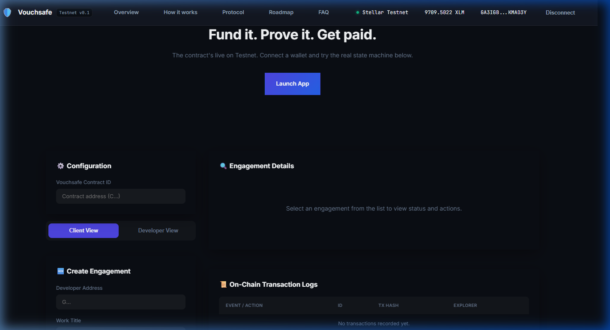

# Vouchsafe — White Belt Documentation (Level 1)

> **Belt Level**: ⚪ White Belt  
> **Status**: ✅ COMPLETED  
> **Target Network**: Stellar Testnet  
> **Live Demo**: [https://vouchsafe-eight.vercel.app ↗](https://vouchsafe-eight.vercel.app)  

---

## 1. Project Description

**Vouchsafe** is an on-chain escrow payment protocol built on the Stellar Testnet using Soroban smart contracts. It eliminates payment risk in technical freelance work and software deliverables.

### Problem Solved
Traditional freelance payments suffer from a fundamental trust gap:
- **Developers** risk non-payment or delayed payout after spending time delivering work.
- **Clients** risk non-delivery or low-quality work when paying upfront.

### Solution
Vouchsafe locks payment funds in a Soroban escrow contract before work begins. The payment is released to the developer's wallet only after the developer submits verifiable proof of work (GitHub commit hash, PR link, deliverable URL) and the client explicitly approves the completed deliverable.

---

## 2. Setup Instructions (How to Run Locally)

Follow these steps to run the Vouchsafe application and test suites on your local machine.

### Prerequisites
- [Node.js](https://nodejs.org/) (v18+ recommended)
- [Rust & Cargo](https://www.rust-lang.org/) (with `wasm32-unknown-unknown` target installed)

### Step 1: Clone Repository
```bash
git clone https://github.com/dollyraikwarr/Vouchsafe.git
cd Vouchsafe
```

### Step 2: Run Frontend Unit Test Suite
```bash
npm test
```
*Executes the 7 frontend unit tests (error classification, formatting, role signing guards, event deduplication).*

### Step 3: Run Smart Contract Unit Tests
```bash
cargo test --workspace
```
*Executes the 14 Rust unit tests across the Vouchsafe workspace.*

### Step 4: Launch Local Application Server
```bash
npx serve . -p 8000
```
Open `http://localhost:8000` in your web browser to interact with the live dApp connected to Stellar Testnet.

---

## 3. Required Level 1 Submission Screenshots

Below are the verified screenshots demonstrating full compliance with all Level 1 (White Belt) submission requirements:

### 📸 1. Wallet Connected State
Demonstrates successful multi-wallet connection modal integration (`StellarWalletsKit`) supporting Freighter, Albedo, and xBull on Stellar Testnet:


---

### 📸 2. Balance Displayed
Demonstrates live query and display of the connected wallet's XLM balance fetched dynamically from the Stellar Horizon Testnet API (`https://horizon-testnet.stellar.org/accounts/<ADDRESS>`):



---

### 📸 3. Successful Testnet Transaction
Demonstrates a successful on-chain transaction executed on Stellar Testnet, updating contract escrow state and transferring funds:


---

### 📸 4. Transaction Result Shown to the User
Demonstrates the user-facing status feedback banner providing instant confirmation, transaction state updates, and clickable links to verify the transaction hash on StellarExpert Explorer:


---

## 4. Official Level 1 Audit Requirements Verification Matrix

| Requirement | Implementation Detail | Verification Status |
|-------------|-----------------------|---------------------|
| **1. Wallet Setup** | Supports Freighter, Albedo, and xBull on Stellar Testnet via `@creit.tech/stellar-wallets-kit`. | ✅ **PASS** |
| **2. Wallet Connection & Disconnect** | Interactive `Connect Wallet` modal trigger & `Disconnect` button clearing session state (`disconnectWallet()`). | ✅ **PASS** |
| **3. Balance Handling** | Live XLM balance query from Horizon Testnet API (`fetchAndDisplayBalance()`) displayed in top navbar badge (`walletBalance`). | ✅ **PASS** |
| **4. Transaction Flow** | Sends contract escrow & token transactions on Stellar Testnet with status feedback & StellarExpert tx hash links. | ✅ **PASS** |
| **5. Development Standards** | Clean modular JS structure (`src/`), Node native test suite (`npm test`), and fully responsive UI. | ✅ **PASS** |
| **6. Submission Checklist** | Public GitHub repo (`dollyraikwarr/Vouchsafe`), setup guide, and screenshot media artifacts. | ✅ **PASS** |

---

## 5. System Architecture & Smart Contract Specs

### Soroban Escrow State Machine Progression
```
    [CREATED]
        │  fund_engagement(id, client)
        ▼
    [FUNDED]
        │  submit_work(id, developer, work_url, work_pr_url, work_commit, work_note)
        ▼
[WORK_SUBMITTED]
        │  approve_work(id, client)
        ▼
   [COMPLETED]  <-- Atomic payout released to developer wallet
```

### Deployed Contract Information
- **Engagement Contract ID**: `CBHLS5OKZWPYZTQA2DH66OJZMD6IZ7U54DVNM3DP5M4R3FSHOOTXMKTR`
- **Native XLM SAC Address**: `CDLZFC3SYJYDZT7K67VZ75HPJVIEUVNIXF47ZG2FB2RMQQVU2HHGCYSC`
- **StellarExpert Explorer**: [View Contract Details ↗](https://stellar.expert/explorer/testnet/contract/CBHLS5OKZWPYZTQA2DH66OJZMD6IZ7U54DVNM3DP5M4R3FSHOOTXMKTR)

