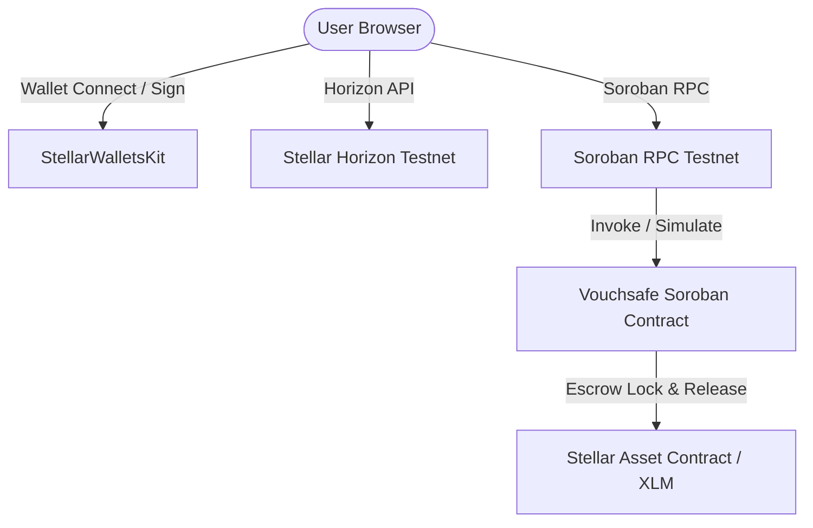

# Vouchsafe — White Belt Documentation (Level 1)

> **Belt Level**: ⚪ White Belt  
> **Status**: ✅ COMPLETED  
> **Target Network**: Stellar Testnet  

---

## 1. Level Objective & Requirements Checklist

The objective of Level 1 (White Belt) is to construct the foundational architecture of the Vouchsafe Stellar dApp on Testnet.

### 📋 Official Level 1 Audit Requirements Verification Matrix

| Requirement | Implementation Detail | Status |
|-------------|-----------------------|--------|
| **1. Wallet Setup** | Supports Freighter, Albedo, and xBull on Stellar Testnet via `@creit.tech/stellar-wallets-kit`. | ✅ **PASS** |
| **2. Wallet Connection** | Interactive `Connect Wallet` modal trigger & `Disconnect` button clearing session state (`disconnectWallet()`). | ✅ **PASS** |
| **3. Balance Handling** | Live XLM balance query from Horizon Testnet API (`fetchAndDisplayBalance()`) displayed in top navbar badge (`walletBalance`). | ✅ **PASS** |
| **4. Transaction Flow** | Sends contract escrow & token transactions on Stellar Testnet with status feedback & StellarExpert tx hash links. | ✅ **PASS** |
| **5. Development Standards** | Clean modular JS structure (`src/`), Node native test suite (`npm test`), and fully responsive UI. | ✅ **PASS** |
| **6. Documentation & Repo** | Public GitHub repo (`dollyraikwarr/Vouchsafe`), setup guide, and screenshot media artifacts. | ✅ **PASS** |

---

## 2. Problem Solved

Traditional technical freelancing relies on informal trust:
- **Developers** risk non-payment after delivering completed work.
- **Clients** risk non-delivery or low quality when paying upfront.

White Belt introduces **Vouchsafe**: an on-chain escrow state machine where funds lock in a Soroban smart contract and only release when deliverable proof is submitted by the developer and explicitly approved by the client.

---

## 3. Product Overview

Vouchsafe White Belt establishes:
- **Wallet Connection & Balance Handling**: Multi-wallet connection via `@creit.tech/stellar-wallets-kit` and live XLM balance querying via Horizon.
- **Direct XLM Payments**: Native payment operation panel (`Operation.payment`) allowing users to transfer XLM directly on Testnet with on-chain confirmation feedback.
- **Escrow State Machine**: Soroban contract managing milestone lifecycle from creation to payment release.

---

## 4. System Architecture



### Key Source Files
- **Smart Contract**: [`contracts/vouchsafe/src/lib.rs`](../contracts/vouchsafe/src/lib.rs)
- **Frontend Core**: [`app.js`](../app.js)
- **User Interface**: [`index.html`](../index.html)
- **Styles**: [`style.css`](../style.css)

---

## 5. Smart Contract State Machine

The contract enforces a strictly linear state progression:

```
    [CREATED]
        │
        │  fund_engagement(id, client)
        ▼
    [FUNDED]
        │
        │  submit_work(id, developer, work_url, work_pr_url, work_commit, work_note)
        ▼
[WORK_SUBMITTED]
        │
        │  approve_work(id, client)
        ▼
   [APPROVED]
        │
        │  (atomic payment release via Soroban Token Client)
        ▼
  [COMPLETED]
```

---

## 6. Smart Contract Functions

Defined in [`contracts/vouchsafe/src/lib.rs`](../contracts/vouchsafe/src/lib.rs):

| Function | Parameters | Returns | Description |
|----------|------------|---------|-------------|
| `create_engagement` | `client: Address, developer: Address, token: Address, amount: i128, deadline: u64` | `u64` (ID) | Initializes engagement record in `CREATED` status. |
| `fund_engagement` | `id: u64, client: Address` | `()` | Transfers `amount` tokens from client to contract; status moves to `FUNDED`. |
| `submit_work` | `id: u64, developer: Address, work_url: String, work_pr_url: String, work_commit: String, work_note: String` | `()` | Records proof of work; status moves to `WORK_SUBMITTED`. |
| `approve_work` | `id: u64, client: Address` | `()` | Transfers escrow tokens from contract to developer; status moves to `COMPLETED`. |
| `get_engagement` | `id: u64` | `Option<Engagement>` | Read-only view of engagement state and deliverables. |

---

## 7. Authorization Rules

Soroban `require_auth()` assertions strictly enforce caller identity:
- `create_engagement`: Requires `client.require_auth()`
- `fund_engagement`: Requires `client.require_auth()`
- `submit_work`: Requires `developer.require_auth()`
- `approve_work`: Requires `client.require_auth()`

---

## 8. Escrow & Payment Logic

- **Funding**: Uses Soroban `token::Client::new(&env, &engagement.token).transfer(&client, &env.current_contract_address(), &amount)`.
- **Payout**: Upon approval, `token::Client::new(&env, &engagement.token).transfer(&env.current_contract_address(), &developer, &amount)` executes atomically before status updates to `Completed`.

---

## 9. Contract Events

Emitted via `env.events().publish(...)`:
- `("created", engagement_id)` -> `(client, developer, amount)`
- `("funded", engagement_id)` -> `client`
- `("submitted", engagement_id)` -> `developer`
- `("approved", engagement_id)` -> `client`
- `("released", engagement_id)` -> `(developer, amount)`
- `("completed", engagement_id)` -> `()`

---

## 10. Frontend Workflow & Wallet Interaction

- Integration via `@creit.tech/stellar-wallets-kit`.
- Native XLM payment module using `StellarSdk.Operation.payment` built via `TransactionBuilder` and submitted to Horizon (`https://horizon-testnet.stellar.org`).
- Direct contract function invocation using Soroban RPC simulation and XDR signing.

---

## 11. Automated Tests

The contract includes **7 comprehensive unit tests** in [`contracts/vouchsafe/src/lib.rs`](../contracts/vouchsafe/src/lib.rs):
1. `test_happy_path`: Full workflow from creation to payment release.
2. `test_unauthorized_funding`: Verification that non-client cannot fund escrow.
3. `test_unauthorized_work_submission`: Verification that non-developer cannot submit work.
4. `test_unauthorized_approval`: Verification that non-client cannot approve work.
5. `test_invalid_state_transitions`: Rejection of premature funding, submission, or approval.
6. `test_double_payment_prevention`: Prevention of re-approving completed engagements.
7. `test_get_nonexistent_engagement`: Handling of invalid IDs.

---

## 12. Contract Deployment

- **Contract ID**: `CBHLS5OKZWPYZTQA2DH66OJZMD6IZ7U54DVNM3DP5M4R3FSHOOTXMKTR`
- **Network**: Stellar Testnet
- **Deployer Address**: `GBCQI56TO2T27F3I4XRZK72NSUFRJAM4M7ZIBCNA35O4W5F7WIJU4VKO`
- **Native XLM SAC**: `CDLZFC3SYJYDZT7K67VZ75HPJVIEUVNIXF47ZG2FB2RMQQVU2HHGCYSC`
- **Explorer Link**: [StellarExpert Contract View ↗](https://stellar.expert/explorer/testnet/contract/CBHLS5OKZWPYZTQA2DH66OJZMD6IZ7U54DVNM3DP5M4R3FSHOOTXMKTR)

---

## 13. Known Limitations (White Belt Stage)

- **Single Wallet State**: Initial White Belt UI stored only one active wallet connection at a time.
- **Generic Errors**: Errors were caught and displayed as single string banners without classification.
- **Simple Event Logging**: Contract events were listed in a plain HTML table without deduplication or live status indicators.

---

## 14. Next Milestone Progression

White Belt accomplishments directly set the stage for **Yellow Belt (Level 2)**, which upgrades the project into a multi-wallet role architecture with transaction state machines, classified error handling, and live event polling synchronization.
