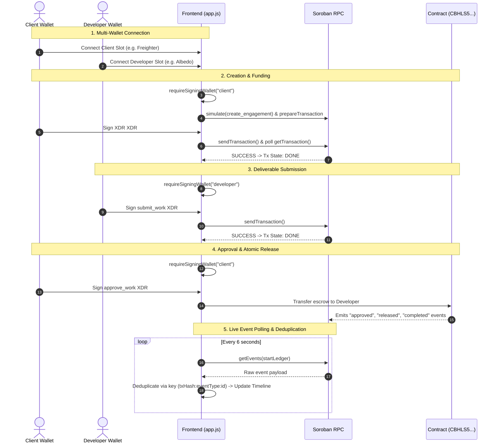

# Vouchsafe — Yellow Belt Documentation (Level 2)

> **Belt Level**: 🟡 Yellow Belt  
> **Status**: ✅ COMPLETED  
> **Target Network**: Stellar Testnet  

---

## 1. Level Objective

The objective of Level 2 (Yellow Belt) is to upgrade Vouchsafe into a production-grade multi-wallet application with:
1. Multi-wallet provider selection via `@creit.tech/stellar-wallets-kit`.
2. Role-segregated wallet slots for Client and Developer signers with strict pre-transaction signing guards.
3. A 5-state transaction lifecycle status machine (`IDLE` → `AWAITING_WALLET_APPROVAL` → `SUBMITTING` → `PENDING_CONFIRMATION` → `SUCCESS` / `FAILED`).
4. Classified error handling distinguishing wallet unavailability, user rejections, and insufficient balances.
5. Real-time, deduplicated Soroban event polling with live sync UI indicators.
6. Verifiable Testnet transaction hashes and comprehensive documentation.

---

## 2. What White Belt Provided vs. Yellow Belt Upgrades

| Aspect | White Belt (Level 1) | Yellow Belt (Level 2) |
|--------|----------------------|-----------------------|
| Wallet Support | Single active wallet connection | Dual role slots (Client & Developer) using StellarWalletsKit |
| Signing Guard | Manual role toggle only | Hard enforcement via `requireSigningWallet(role)` before XDR build |
| Transaction Status | Simple text banner | 5-state visual machine with 4-step progress trail (`🔐 Wallet › 📡 Submit › ⏳ Confirm › ✅ Done`) |
| Error Handling | Single generic catch block | Code-first error classifier (`classifyError()`) for 8 distinct error types |
| Event Logging | Static HTML table | Deduplicated live event timeline with "⛓ From blockchain" source badges & pulsing sync dot |
| Wallet Providers | Single modal trigger | Provider selection supporting Freighter, Albedo, xBull, LOBSTR, Hana |

---

## 3. Architecture Overview



---

## 4. Multi-Wallet Integration & Role Slots

Implemented in [`app.js`](../app.js):
- **Client Wallet Slot**: Stores `{ address, providerId }` for the Client. Signs `create_engagement`, `fund_engagement`, and `approve_work`.
- **Developer Wallet Slot**: Stores `{ address, providerId }` for the Developer. Signs `submit_work`.

### Supported Wallet Providers
Configured via `allowAllModules()` in `StellarWalletsKit`:
1. **Freighter** (Browser extension)
2. **Albedo** (Web-based, no extension required)
3. **xBull** (Browser extension)
4. **LOBSTR** (Mobile deep-linking)
5. **Hana** (Browser extension)

---

## 5. Signing Guards & Role Verification

To prevent signing transactions with an incorrect wallet, `requireSigningWallet(role)` is called at the beginning of every action handler:

```javascript
async function requireSigningWallet(requiredRole) {
  const slot = requiredRole === "client" ? clientWallet : developerWallet;
  if (!slot.address || !slot.providerId) {
    const err = new Error(`Please connect your ${requiredRole} wallet first.`);
    err.code = "NO_WALLET";
    throw err;
  }
  kit.setWallet(slot.providerId);
  return slot.address;
}
```

If a user tries to perform a developer action with a client wallet (or vice-versa), the operation is halted before XDR generation and displays a clear role notice.

---

## 6. Transaction State Machine

Contract actions drive a 5-stage UI status banner:

```
[IDLE] ──► [AWAITING_WALLET_APPROVAL] ──► [SUBMITTING] ──► [PENDING_CONFIRMATION] ──► [SUCCESS]
                                                                                └──► [FAILED]
```

- **AWAITING_WALLET_APPROVAL**: Displays spinner + `🔐 Wallet` step active. Prompting wallet popup.
- **SUBMITTING**: `📡 Submit` step active. XDR sent to Soroban RPC.
- **PENDING_CONFIRMATION**: `⏳ Confirm` step active. Polling `getTransaction()` until ledger inclusion.
- **SUCCESS**: `✅ Done` step active. Displays transaction hash and link to StellarExpert.
- **FAILED**: Displays human-readable classified error and recovery suggestions.

---

## 7. Classified Error Handling System

The `classifyError()` function in [`app.js`](../app.js) evaluates error objects using a code-first strategy:

| Error Type | Trigger / Detection Mechanism | User-Facing Message | Recovery Action |
|------------|-------------------------------|---------------------|-----------------|
| **`WALLET_UNAVAILABLE`** | `err.code === "NO_WALLET"` or string matching `"not installed"` / `"provider not found"`. | "Wallet Not Available: The selected wallet is not installed or cannot be accessed." | Install wallet extension or select Albedo. |
| **`USER_REJECTED`** | `err.code === 4001` / `-1` or message string matching `"user rejected"` / `"cancelled"`. | "Transaction Cancelled: You rejected the transaction in your wallet." | Click action button to retry. |
| **`INSUFFICIENT_BALANCE`** | Horizon `result_codes` (`op_underfunded`, `tx_insufficient_balance`, `op_no_trust`). | "Insufficient Balance: Your wallet does not have enough XLM or tokens." | Fund account via Friendbot. |
| **`WRONG_ROLE`** | Contract panic `"caller must be the client/developer"` or caller mismatch. | "Wrong Role / Authorization: You are not authorized to perform this action." | Connect correct role wallet. |
| **`INVALID_STATE`** | Simulation/RPC error containing `"invalid state"` or premature transition. | "Invalid Contract State: Action cannot be performed in current status." | Refresh engagement list. |
| **`WRONG_NETWORK`** | Passphrase mismatch or mainnet warning. | "Wrong Network: Connected to wrong network." | Switch wallet to Testnet. |
| **`RPC_FAILURE`** | Network timeout / RPC fetch errors. | "Network Error: Could not reach Stellar Testnet RPC." | Retry in a few seconds. |
| **`TX_TIMEOUT`** | Ledger confirmation exceeding 30 seconds. | "Transaction Timeout: Confirmation delayed." | Check Activity tab or Explorer. |

---

## 8. Real-Time Event Synchronization & Deduplication

- **Polling Loop**: `startOnChainEventPolling()` polls `rpcServer.getEvents()` every 6 seconds.
- **Unique Event Key**: `txHash:eventType:engagementId`.
- **Deduplication**: Key is checked against `displayedEventKeys` Set before appending to the Activity feed, preventing duplicate UI entries.
- **Visual Sync**: A pulsing green dot (`.sync-indicator.sync-active`) indicates live blockchain polling.

---

## 9. Contract Evidence & Deployment Verification

- **Deployed Contract ID**: `CBHLS5OKZWPYZTQA2DH66OJZMD6IZ7U54DVNM3DP5M4R3FSHOOTXMKTR`
- **Network**: Stellar Testnet
- **StellarExpert Contract Link**: [View Contract ↗](https://stellar.expert/explorer/testnet/contract/CBHLS5OKZWPYZTQA2DH66OJZMD6IZ7U54DVNM3DP5M4R3FSHOOTXMKTR)

### Verifiable Live On-Chain Transactions
Executed and confirmed on Stellar Testnet via automated E2E verification (`testnet_e2e.js`):

1. **Create Engagement**:
   - Hash: [`c088da058f67426bb675f0167df48dc34199f070aff3b24e18073f88a19c3ef3`](https://stellar.expert/explorer/testnet/tx/c088da058f67426bb675f0167df48dc34199f070aff3b24e18073f88a19c3ef3)
2. **Fund Escrow**:
   - Hash: [`abfdbb455790385de32675fe8ecb7fa99f10d52fbfbc8f3f64ab58d82580541e`](https://stellar.expert/explorer/testnet/tx/abfdbb455790385de32675fe8ecb7fa99f10d52fbfbc8f3f64ab58d82580541e)
3. **Submit Work Proof**:
   - Hash: [`4d3acf2d031b80862a5b2f04d786a005cd0cb79b8b6102ff7c899ca1fe7cb14c`](https://stellar.expert/explorer/testnet/tx/4d3acf2d031b80862a5b2f04d786a005cd0cb79b8b6102ff7c899ca1fe7cb14c)
4. **Approve & Release Escrow**:
   - Hash: [`024c19ec4da8dba99d1b247e2e1c61a8cd1b0fab5bfaaf28f2b12ababc76bf93`](https://stellar.expert/explorer/testnet/tx/024c19ec4da8dba99d1b247e2e1c61a8cd1b0fab5bfaaf28f2b12ababc76bf93)

---

## 10. Git Commit Evidence

The Yellow Belt functionality is committed in the repository history:
- `17f3e60`: `feat(yellow-belt): multi-wallet role system, tx state machine, classified error handling`
- `f0f9bfb`: `docs(yellow-belt): complete README with all 24 required sections, event arch, error types, tx lifecycle, wallet options, contract evidence`
- `6d05bea`: `docs(yellow-belt): add live Testnet transaction hashes, contract evidence links, and wallet modal screenshot`

---

## 11. Visual Media & Screenshots

| Artifact | Media Link |
|----------|------------|
| Wallet Selection Modal |  |
| App Dashboard & State Machine |  |

---

## 12. Testing Verification Results

- **Contract Unit Tests**: 7/7 tests passing (`test_happy_path`, `test_unauthorized_funding`, `test_unauthorized_work_submission`, `test_unauthorized_approval`, `test_invalid_state_transitions`, `test_double_payment_prevention`, `test_get_nonexistent_engagement`).
- **Integration Tests**: `testnet_e2e.js` verified state transitions and verified double-release prevention on live Testnet.

---

## 13. Known Limitations

- **Dispute Resolution**: If a client refuses to approve, funds remain in escrow. (Targeted for Orange Belt multi-sig arbitration).
- **Automated Refund Expiry**: Deadlines are recorded on-chain but contract refund triggers require manual invocation.
- **Testnet Scope**: Deployed on Testnet only.

---

## 14. Next Milestone Progression

With Yellow Belt fully implemented and verified, the next milestone is **Orange Belt (Level 3)**, focusing on multi-milestone engagements, dispute arbitration, and expanded mini-dApp capabilities.
